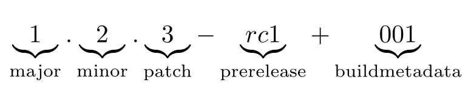

<a href="https://crates.io/crates/semver-query"></a>
# semver-query



`semver-query` is a utility for querying [semantic version](https://semver.org/) data.

## usage 

```
Usage: semver-query [OPTIONS] --query <query> [filename]

Arguments:
  [filename]  the input file name. It must contain line separated entries. 
              If not provided, the program attempts to read from the standard input.

Options:
  -q, --query <query>  defines the query to apply to the input
      --strict         defines whether to fail if an entry does not match the semantic versioning regular pattern
  -h, --help           Print help
  -V, --version        Print version
```

## Input format:

The program accepts a list of line separated entries, for example: 

```
v1.31.2
v1.31.1
v1.31.0
v1.30.4
v1.30.3
v1.30.2
v1.30.1
v1.30.0
v1.29.15
v1.29.14
v1.29.13
```

For example, the convention when using git, is that every release is associated with a tag. The input can be generated using `git tag --list`. In this case, the output of the `git` command can be piped directly to `semver-query`: 

```bash
git tag --list | semver-query --strict --query "minor == 17 and patch > 0"
```

Another alternative is using the Github api:

```bash
curl -v -H "Accept: application/vnd.github+json" -H "X-GitHub-Api-Version: 2022-11-28" -H "Authorization: Bearer $TOKEN"  "https://api.github.com/repos/tensorflow/tensorflow/tags?per_page=100&page=2" | jq -r  '.[].name' > releases.txt

semver-query --strict --query "major == 2 and minor > 13" releases.txt
```

## Use cases

Imagine you are preparing an environment and you need the installed software to match certain version criteria. You can use `semver-query` to automate the process of selecting the version of software that match certain criteria. 


Imagine you want to test your app with several versions of a library: "I want to make sure that my app works with the three latest minor versions for major version Y of library X". You can use `semver-query` from a CI environment to make sure you select the three latest minor versions of library X

## Query syntax

The query supports the `lua` programming language syntax and can be written like an if statement condition. 

### Variables

| Name    | Type |
| -------- | ------- |
| major  | number   |
| minor | number     |
| patch    | number    |
| prerelease    | string    |
| buildmetadata    | string    |

### Comparison Operators

All the `lua` comparison operators are supported: `<`, `>`, `<=`, `>=`, `==`, `~=`

### Logical Operators

The supported logical operators are `and` and `or`.

### Backus–Naur Form Grammar

```
<query>      ::= <predicates>
<predicates>  ::= <predicate> <logical-operator> <predicate> | <predicates> <logical-operator> <predicate>
<predicate>  ::= <number-variable> <comparison-operator> <digits> | <string-variable> <comparison-operator> <string>
<logical-operator> ::= and | or
<number-variable> ::= major | minor | patch
<string-variable> ::= prerelease | buildmetadata
<comparison-operator> ::= < | > | <= | >= | == | ~=
```

## Query examples

* `major == 2 and minor >= 7 and minor <= 9`
* `major <= 20 and minor > 0`
* `minor >= 29 and patch > 0`
* `minor == 29 and pre_release ~= 'alpha.0' and pre_release ~= 'alpha.1' and pre_release ~= 'alpha.2' and pre_release ~= 'alpha.3'`
* `major >= 17 and major <= 20 and patch > 1 and patch <= 3`

## Installation

### Cargo

 `cargo install semver-query`. 

### Downloading the binary 

For each release, binaries are published for the following platforms: 

- x86_64-apple-darwin
- x86_64-unknown-linux-gnu
- aarch64-apple-darwin
- aarch64-unknown-linux-gnu

Note to Windows users: sorry but I was not able compile the project for the platforms (x86_64-pc-windows-msvc, aarch64-pc-windows-msvc). Help is welcome. 

The download link can be found in the release [page](https://github.com/zak905/semver-q/releases)

### Compiling from source

the project can be built using `cargo build -r`, after cloning the repository. 

## Work in progress:

* Sorting
* Limits
* Pattern matching
* Output delimiters 
